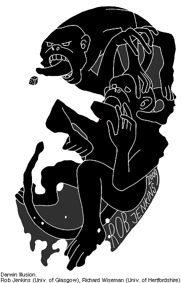

# Darwin Illusion
## Description:

## Instructions: 

* Stare at the red dot for about 1 minute. 
* Then change immediately to the white screen. 
* Should see an shadow of Charles Darwin's face. 

## The Illusion

## What Your Brain Is Doing: 

## Why Its Cool

