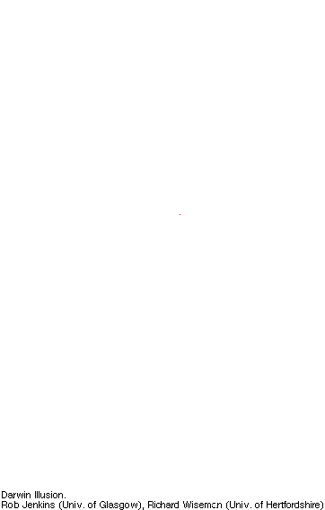

# Darwin Illusion
## Description:

## Instructions: 

* Stare at the red dot for about 1 minute. 
* Then change immediately to the white screen. 
* Should see an shadow of Charles Darwin's face. 

## The Illusion

## What Your Brain Is Doing: 

* The illusion combines two visual effects. First, staring at the picture produces
a negative afterimage, in which the black-and-white pattern is reversed. Second, the
`resolution' of the afterimage is lower than that of the actual image, and so the thin
white lines vanish, making it impossible to see the monkeys. 
* This shows rapid changes in perceptual sensitivity, including the brain's adjustment to brightness
that gives rise to the negative afterimage in the illusion

## Why Its Cool

* This illusion shows the very concept that Charles Darwin coined - 'evolution' and its subsequest adaptation. 

