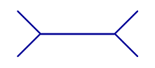
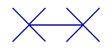

# Müller-Lyer Illusion
## Description:

## Instructions: 

* Debate if the two middle lines of the 'long' and 'short' are equal, longer or shorter than the other. 
*  In fact, they are both the same, you can show the completed illusion of the two images synthesised as one.

## The Illusion

## What Your Brain Is Doing: 

* This illusion occurs because of a misapplication of size constancy scaling
* Our brains perceive the depths of the two shafts based upon depth cues. When the fins are pointing in toward the shaft of the line, we perceive it as sloping away much like the corner of a building. This depth cue leads us to see that line as further away and therefore shorter. When the fins are pointing outward away from the line, it looks more like the corner of a room sloping toward the viewer. This depth cue leads us to believe that this line is closer and therefore longer.

## Why Its Cool

* Studies have shown that those living in less rectilinear environments (e.g. many rural environments) are less susceptible to the illusion 