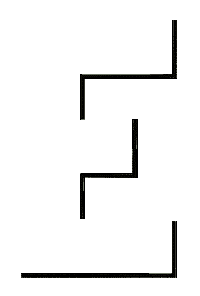
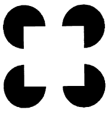
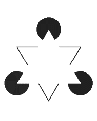

# Letter 'E' Illusion
## Description:

## Instructions: 

* Ask viewers what they see 
* In fact, the letter 'E' is not there. There are simply lines which create the visual illusion. 

## The Illusion

## What Your Brain Is Doing: 

## Why Its Cool

# Square Completion Illusion
## Description:

## Instructions: 

* Ask viewers what they see 
* In fact, the shape of a 'square' is not there. There are simply lines which create the visual illusion. 

## The Illusion

## What Your Brain Is Doing: 

## Why Its Cool

# Triangle Completion Illusion
## Description:

## Instructions: 

* Ask viewers what they see 
* In fact, the shape of a 'triangle' is not there. There are simply lines which create the visual illusion. 

## The Illusion

## What Your Brain Is Doing: 

* It is generally accepted that contour completion is an example of the perceptual system rejecting ‘coincidence’, in the sense that a symmetrical arrangement of fragments and line elements as seen in the Kanizsa triangle is unlikely in the natural environment. 
* As far as physiology goes, Peterhans et al. (1986) suggest that the illusory completed contour can be explained by the action of end-stopped neurons in the visual cortex. These cells correspond to elongated receptive fields on the retina and can fire selectively for both length and orientation of stimulus. Activity in spatially separated, end-stopped cells may trigger a gating mechanism, allowing for communication between neurons at previously inactive synapses.

## Why Its Cool

* On reflection, one can tell that there is no such boundary and there is not a difference in luminance, colour or texture where there appears to be one; but, nonetheless, that is what we experience

