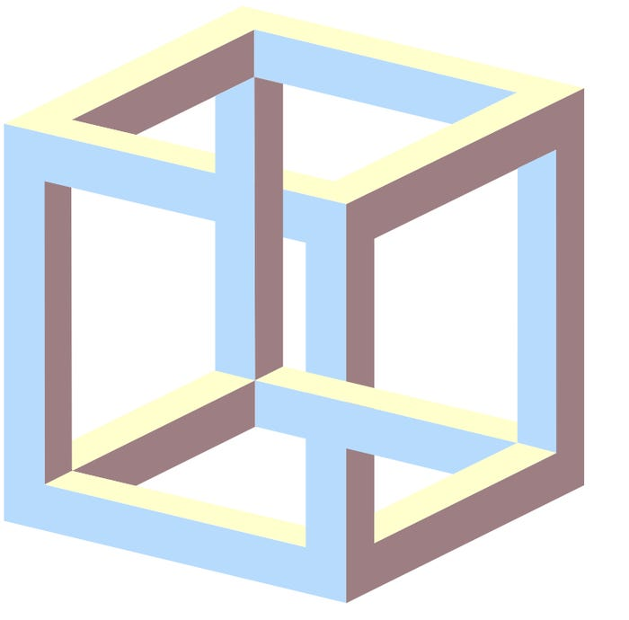

# Impossible Shapes 

## Description:

## Instructions: 

* Look at the shape and work out how it can be true
* The shape is implied, the figure cannot possibly work. 
* The shape itself is a paradox

## The Illusion

# Cube Illusion 

# Penrose Triangle Illusion 

## What Your Brain Is Doing: 

* It consists of a two-dimensional figure which is instantly and subconsciously interpreted by the visual system as representing a projection of a three-dimensional object.
* The effect is interesting because each part of the picture is ambiguous by itself, yet the human visual system picks an interpretation of each part that makes the whole consistent. 
* The illusion plays on the human eye's interpretation of two-dimensional pictures as three-dimensional objects. It is possible for three-dimensional objects to have the visual appearance of the impossible cube when seen from certain angles, either by making carefully placed cuts in the supposedly solid beams or by using forced perspective, but human experience with right-angled objects makes the impossible appearance seem more likely than the reality.

## Why Its Cool

* There is evidence that by focusing on different parts of the figure, one can force a more stable perception of the cube.
* The Necker cube is sometimes used to test computer models of the human visual system to see whether they can arrive at consistent interpretations of the image the same way humans do.
