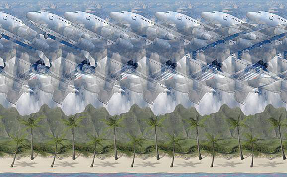
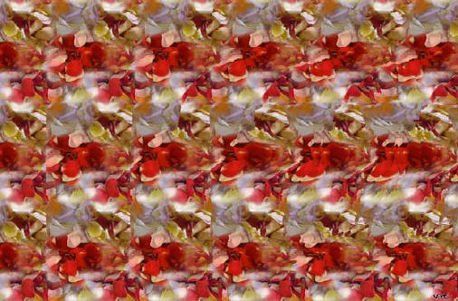

# Stereograms 

## Description:

## Instructions: 

* Stare at the centre 
* Relax vision 
* Look 'through' the image 
* it will become a blurry 3D image
* wait until it focuses 

## The Illusion

# Planes Illusion 

# Roses Illusion 

## What Your Brain Is Doing: 

## Why Its Cool

