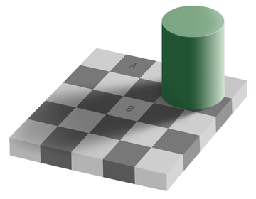

# Adelson’s Same Color Illusion
## Description:

## Instructions: 

* Debate whether block 'a' and 'b' are the same colours or different. 
*  In fact, they are both the same. Light plays a large role when it comes to illusions that we see. 

## The Illusion

## Proof

## What Your Brain Is Doing: 

## Why Its Cool

