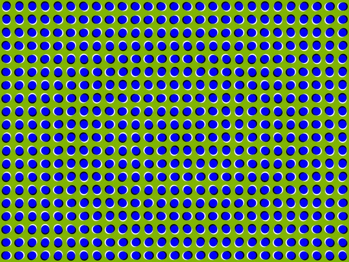
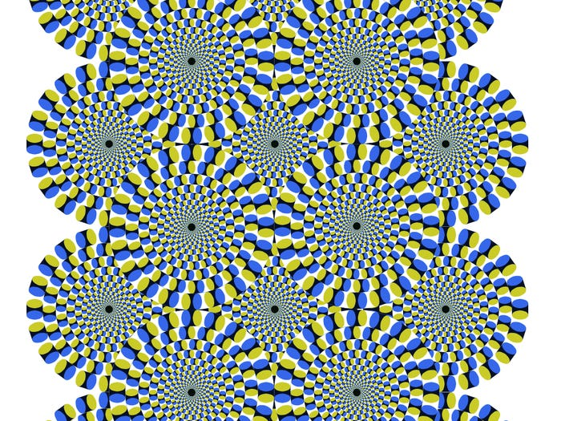

# Illusory Motion Illusion
## Description:

## Instructions: 

* Stare at any point of the image. 
* Do you see movement? 
* There is no movement in the image, the movement is implied by the construction of the shapes and colours. 

## The Illusions

### Moving Dots

### Moving Snakes 

### Stepping Feet 

## What Your Brain Is Doing: 

## Why Its Cool

