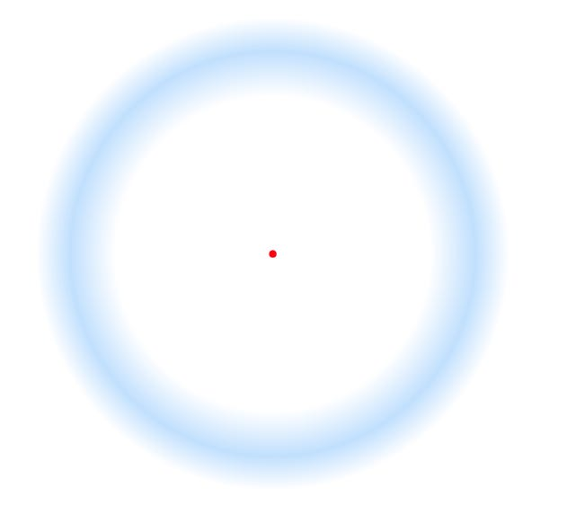

# Troxler Effect

## Description:

## Instructions: 

* Stare at the red dot
* After a while the blue ring will start to disappear. 

## The Illusion

## What Your Brain Is Doing: 

* Troxler made the discovery that rigidly fixating one’s gaze on some element in the visual field can cause surrounding stationary images to seem to slowly disappear or fade.
* When we attempt to fix our gaze on an object, the eye undergoes extremely rapid and relatively large-scale sudden movements called microsaccades, in contrast to saccadic drifts or small oscillations. Microsaccades cause the pattern of activity which forms the retinal image to shift across hundreds of photoreceptors at a time, providing a constant “refreshing” of the image (Martinez-Conde 2010). The Troxler effect occurs with any stationary stimulus, but it is particularly fast-acting and noticeable with low-contrast stimuli (so note the persistence of the cat’s grin, which is of higher contrast than the rest of the image). Such stimuli fail to trigger certain retinal mechanisms such as centre-surround ganglion cells which generate increased signal strength 

## Why Its Cool

* The Troxler Effect an its fading is said to explain the origins of imaginary monsters. The Troxler Effect fades out features that a person isn't directly staring at. Those features are filled in with what's around them - and a 'monster' can be formed. 